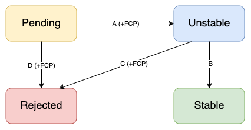

# Cedar RFC Process

The "RFC" (request for comments) process is intended to provide a consistent and controlled path for new features to enter the Cedar language. Many changes, including bug fixes and documentation improvements, can be implemented and reviewed via the normal GitHub pull request workflow. Some changes though are "substantial", and we ask that these be put through a bit of a design process to produce a consensus among the Cedar core team and the community.

## The RFC life-cycle

An RFC goes through some subset of the following stages:

* [**Pending**](https://github.com/cedar-policy/rfcs/issues?q=label%3Apending%2Carchived):
    when the RFC is submitted as a pull request (PR) to this repository.
    We use PRs to provide design feedback and come to a consensus about whether an RFC should be accepted or rejected.
    Before an RFC is officially accepted or rejected, they must undergo a [Final Comment Period](https://github.com/cedar-policy/rfcs/issues?q=label%3Afinal-comment-period+),
    a sub-stage representing the “last chance” for public comments or objections to the decision.
    Cedar maintainers will announce the FCP's beginning and end, and whether the intent is to accept or reject the RFC following the FCP.
    The FCP will typically last one calendar week.
    At the end of the FCP, if there was no new substantial discussion, the RFC will move to the next stage.
* [**Unstable**](https://github.com/cedar-policy/rfcs/issues?q=label%3Aunstable+):
    the RFC is officially accepted.
    Note that a proof-of-concept implementation may not be available at this point.
    See [Experimental features](#experimental-features) for more details.
* [**Stable**](https://github.com/cedar-policy/rfcs/issues?q=label%3Astable+):
    the RFC is officially accepted and its changes have met the [stabilization requirements](#stabilization-requirements).
    This implies that the RFC does not include outstanding questions nor the proposed changes differ from the implementation.
    Additionally, the implementation meets the specification and testing requirements for stabilization.
* [**Rejected**](https://github.com/cedar-policy/rfcs/issues?q=label%3Arejected%2Csuperceded%2Cmoved-to-issue):
    the RFC is officially rejected or dropped.

Here's a flowchart of the RFC process: (Newly-opened RFCs start in [Pending](https://github.com/cedar-policy/rfcs/issues?q=label%3Apending))

Note: The previous version of the RFC process can be found [here](./archive/process-v1/).

### Experimental features

During the "Pending" and/or "Unstable" stages, an experimental Rust implementation may be available
via a dedicated Cargo feature (one feature per RFC), including on `main` and in crates.io releases.
The RFC's changes may not yet be reflected in the formal model or Cedar DRT infrastructure in [cedar-spec].
Experimental features are unstable and do not come with semver guarantees — they may undergo breaking changes even in dot releases or patch releases.
This is analogous to Rust “nightly features”.

Experimental features are a way for the community to “try out” a feature that may still undergo revisions, and are also a way for contributors to help implement Cedar features in Rust without needing to make changes to the formal model or Cedar DRT infrastructure.

### More details on particular edges

* Edge A — Accepting an RFC: Following an FCP with intent to accept, if there was no new substantial discussion during the FCP, the RFC will be accepted, and it becomes "Unstable".
* Edge B — Stabilizing an RFC: To start the stabilization process, open a PR in [`cedar`](https://github.com/cedar-policy/cedar) that removes the dedicated feature flag for this RFC and makes the feature available to all Cedar users.  See [Stabilization requirements](#stabilization-requirements) below for more on the requirements for this edge. If the stabilization PR is accepted, the change will be merged to `main` and released with the next appropriate Cedar release, following semver. Then, open a PR to mark the RFC "Stable".
* Edge C — Rejecting an unstable RFC: Sometimes an RFC could still be rejected based on additional discussion or implementation concerns that come to light during the unstable stage. However, since the RFC was previously accepted, this edge requires the same bar as an RFC itself, including an FCP with intent to reject. After rejecting the unstable RFC, update the markdown document to note the rejection date and move it from `text/`  into `archive/rfc/`.
* Edge D — Rejecting a pending RFC: Following an FCP with intent to reject, if there was no new substantial discussion during the FCP, the RFC will be rejected. The FCP is not required if the author of the RFC chooses to withdraw it.

### Stabilization requirements

Stabilizing a new feature (edge B above) requires the following:

* Implementation of the RFC passes code review and tests
* If applicable, corresponding changes have been made to the [cedar-spec] repo, both the formal model and the DRT infrastructure
* All outstanding questions about the RFC are resolved; e.g., all other PRs in the `rfcs` repo that relate to this RFC’s text have been closed one way or another
* RFC text has been updated to match the final implementation of the feature, if the implementation has diverged from the original RFC

## When to follow this process

You need to follow this process if you intend to make "substantial" changes to Cedar (<https://github.com/cedar-policy/cedar>). If you wish to suggest changes to other cedar-adjacent repositories like [cedar-spec] or [cedar-examples], please use their respective issue lists.

What constitutes a "substantial" change is evolving based on community norms, but may include the following:

* A new feature that creates new API surface area
* Changing the semantics or behavior of an existing API
* Adding, removing, or changing the behavior of a built-in function or operator in the Cedar language, or any other Cedar syntax
* The removal of features that are already shipped as part of the release channel

Some changes do not require an RFC:

* Simple bug fixes
* Fixing objectively incorrect behavior
* Rephrasing, reorganizing or refactoring
* Addition or removal of warnings
* Improvement of error messages
* Additions only likely to be noticed by other Cedar developers, invisible to users.

If you submit a pull request to implement a new feature without going through the RFC process, it may be closed with a polite request to submit an RFC first.

## Why do you need to do this

You are suggesting new features or changes to Cedar — we appreciate your willingness to contribute! We have to carefully consider the impact of every change we make that may affect end users. These constraints and tradeoffs may not be immediately obvious to users who are proposing a change to solve a specific problem they just ran into. The RFC process serves as a way to guide you through our thought process when making changes to Cedar, so that everyone can be on the same page when discussing why these changes should or should not be made.

It's often helpful to get feedback on your concept before diving into the design details required for an RFC. You may open an issue with a `Question` label on this repo to start a high-level discussion, with the goal of eventually formulating an RFC pull request with the specific implementation design.

## What is the process?

In short, to get a major feature added to Cedar, you must first get the RFC merged into the RFC repo as a markdown file. At that point the RFC is "Unstable" and may be implemented with the goal of eventual inclusion into Cedar.

* Work on your proposal in a markdown file based on the template (<https://github.com/cedar-policy/rfcs/blob/main/text/0000-template.md>). Put care into the details: RFCs that do not present convincing motivation, demonstrate understanding of the impact of the design, or are disingenuous about the drawbacks or alternatives tend to be poorly-received. Copy your markdown file into `text/0000-my-feature.md`, where my-feature is descriptive.
* Fork this repository and create a PR with your markdown file. Once you have a PR, fill in the number in your filename with the PR number (e.g., `0003-my-feature.md` for PR #3). We will use this PR to provide feedback and to come to a consensus on whether the RFC should be accepted. Revisions to the RFC based on feedback should be done in the same PR.
* Your RFC is now "Pending". See [the RFC life-cycle](#the-rfc-life-cycle) above for more on the next steps.

## Implementing an RFC

The author of an RFC is not obligated to implement it.
Of course, the RFC author (like any other developer) is welcome to post an implementation for review before or after RFC has been accepted.
If you are interested in working on the implementation for an RFC, but cannot determine if someone else is already working on it, feel free to ask (e.g. by leaving a comment on the associated PR).

Proof-of-concept implementations are encouraged but not required for an RFC to be accepted.
If there is a PR open for the proof-of-concept implementation, we recommend linking it in the RFC.
Feedback for the actual implementation should be conducted in the implementation PR instead of the original RFC PR.

## Reviewing RFCs

Members of the core team will attempt to review open RFC PRs on a regular basis. Once the core team agrees that an RFC should be accepted/rejected, a member of the core team will leave a comment on the PR with the decision and an explanation for the decision, and start the final comment period (FCP). After the FCP, pending no further discussion, a member of the core team will close the PR (if the RFC is rejected) or merge the PR (if the RFC is accepted).

## Acknowledgments

Cedar's RFC process owes its inspiration to the [Vue RFC process](https://github.com/vuejs/rfcs), [React RFC process](https://github.com/reactjs/rfcs), and [Rust RFC process](https://github.com/rust-lang/rfcs).

## License

This project is licensed under the Apache-2.0 License.

[cedar-spec]: https://github.com/cedar-policy/cedar-spec/
[cedar-examples]: https://github.com/cedar-policy/cedar-examples
