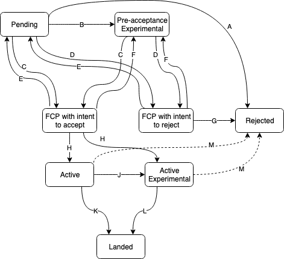

# Cedar RFC Process

The "RFC" (request for comments) process is intended to provide a consistent and controlled path for new features to enter the Cedar language. Many changes, including bug fixes and documentation improvements, can be implemented and reviewed via the normal GitHub pull request workflow. Some changes though are "substantial", and we ask that these be put through a bit of a design process to produce a consensus among the Cedar core team and the community.

## The RFC life-cycle

An RFC goes through some subset of the following stages:

* [**Pending**](https://github.com/cedar-policy/rfcs/issues?q=label%3Apending%2Carchived): when the RFC is submitted as a pull request (PR) to this repository. We use PRs to provide design feedback and come to a consensus about whether an RFC should be accepted.
* [**Pre-acceptance Experimental**](https://github.com/cedar-policy/rfcs/issues?q=label%3Apre-acceptance-experimental+): the RFC has not yet been accepted (or rejected), but permission has been given for an “experimental” Rust implementation on `main` via a dedicated Cargo feature.  See “Experimental features” below.
* [**Final comment period (FCP)**](https://github.com/cedar-policy/rfcs/issues?q=label%3Afinal-comment-period+): the “last chance” for public comments or objections before an RFC is officially accepted or rejected.  Cedar maintainers will announce the FCP’s beginning and end, and whether the intent is to accept or reject the RFC following the FCP.  The FCP will typically last one calendar week.  At the end of the FCP, if there was no new substantial discussion, the RFC will either be accepted (entering the Active state below) or rejected.
* [**Active**](https://github.com/cedar-policy/rfcs/pulls?q=label%3Aactive+): when an RFC’s associated PR is merged. The RFC being active does not guarantee that it is currently under development.  It also does not guarantee that the changes will eventually be accepted or released in the originally envisioned form — it is possible that the RFC could still be modified or even rejected via additional PRs to the `rfcs` repo modifying the RFC’s text.  However, a PR proposing to reject an already-active RFC will be subject to the same bar as an RFC itself, including requiring an FCP.
* **Active Experimental**: the RFC is Active and also has an experimental Rust implementation available via a dedicated Cargo feature. See "Experimental features" below.
* [**Landed**](https://github.com/cedar-policy/rfcs/issues?q=label%3Alanded+): the RFC's changes have been accepted to the `main` branch (with no experimental feature flag) and will be released with the next appropriate Cedar release, following semver.
* [**Rejected**](https://github.com/cedar-policy/rfcs/issues?q=label%3Arejected%2Csuperceded%2Cmoved-to-issue): the RFC is officially rejected or dropped.

Here's a flowchart of the RFC process: (Newly-opened RFCs start in Pending)

### Experimental features

Some RFCs will go through a “Pre-acceptance Experimental” and/or an “Active Experimental” phase.  During these phases, an experimental Rust implementation may be available via a dedicated Cargo feature (one feature per RFC), including on `main` and in crates.io releases.  The RFC’s changes may not yet be reflected in the formal model or Cedar DRT infrastructure in [cedar-spec].  Experimental features are unstable and do not come with semver guarantees — they may undergo breaking changes even in dot releases or patch releases.  This is analogous to Rust “nightly features”.

Experimental features are a way for the community to “try out” a feature that may still undergo revisions, and are also a way for contributors to help implement Cedar features in Rust without needing to make changes to the formal model or Cedar DRT infrastructure.

### More details on particular edges

* Edge A — Closing a pending RFC: Typically this only happens if the RFC author unilaterally chooses to close their RFC.  If Cedar maintainers wish to reject a pending RFC, they’ll instead use edge G.
* Edge B — Moving to Pre-acceptance Experimental: With agreement from two Cedar maintainers (via comment on the RFC PR), an RFC may be moved to Pre-acceptance Experimental, which allows Rust implementation to be merged to `main` behind a Cargo feature flag.
* Edges C and D — Moving to FCP: After discussion on the RFC PR is clearly trending either towards accept (edge C) or reject (edge D), and all major questions have been resolved, the Cedar maintainers will meet and declare the RFC to have entered FCP, with the intent either to accept (edge C) or reject (edge D) the RFC.
* Edges E and F — Aborting FCP: If substantial new issues are raised during the FCP process, the RFC may be returned to its previous state, either Pending (edge E) or Pre-acceptance Experimental (edge F), for more discussions or revisions.
* Edge G — Rejecting an RFC: Following FCP-with-intent-to-reject, if there was no new substantial discussion during the FCP, the RFC will be rejected.
* Edge H — Accepting an RFC: Following FCP-with-intent-to-accept, if there was no new substantial discussion during the FCP, the RFC will be accepted, and it becomes Active (or, if an experimental feature is already available at this time, then it becomes Active Experimental).
* Edge J — Landing as an experimental feature: This requires that the implementation of the RFC passes code review and tests, but does not require that the corresponding changes have been made to the [cedar-spec] repo (yet).  The code will be merged to `main` but hidden behind a dedicated Cargo feature.
* Edge K — Landing an active RFC: This requires that the implementation of the RFC passes code review and tests.  See “Stabilization requirements” below for more on the requirements for this edge.  When the PR is accepted, the code will be merged to `main` and released with the next appropriate Cedar release, following semver.
* Edge L — Stabilizing an experimental feature: To start the stabilization process, open a PR to `cedar` that removes the dedicated feature flag for this RFC and makes the feature available to all Cedar customers (stabilizes it).  See “Stabilization requirements” below for more on the requirements for this edge.  If the stabilization PR is accepted, the change will be merged to `main` and released with the next appropriate Cedar release, following semver.
* Edge M — Closing an Active or Active-Experimental RFC: Sometimes active RFCs could still be rejected based on additional discussion while it is active, or based on new implementation concerns that come to light during the active phase.  However, since the RFC was previously accepted, this edge requires the same bar as an RFC itself, including requiring an FCP.  This higher bar is represented as a dotted-line edge on the flowchart.

### Stabilization requirements

Stabilizing a new feature (edges K or L above) requires the following:

* Implementation of the RFC passes code review and tests
* If applicable, corresponding changes have been made to the [cedar-spec] repo, both the formal model and the DRT infrastructure
* All outstanding questions about the RFC are resolved; e.g., all other PRs in the `rfcs` repo that relate to this RFC’s text have been closed one way or another
* RFC text has been updated to match the final implementation of the feature, if the implementation has diverged from the original RFC

## When to follow this process

You need to follow this process if you intend to make "substantial" changes to Cedar (<https://github.com/cedar-policy/cedar>). If you wish to suggest changes to other cedar-adjacent repositories like [cedar-spec] or [cedar-examples], please use their respective issue lists.

What constitutes a "substantial" change is evolving based on community norms, but may include the following:

* A new feature that creates new API surface area
* Changing the semantics or behavior of an existing API
* Adding, removing, or changing the behavior of a built-in function or operator in the Cedar language, or any other Cedar syntax
* The removal of features that are already shipped as part of the release channel

Some changes do not require an RFC:

* Simple bug fixes
* Fixing objectively incorrect behavior
* Rephrasing, reorganizing or refactoring
* Addition or removal of warnings
* Improvement of error messages
* Additions only likely to be noticed by other Cedar developers, invisible to users.

If you submit a pull request to implement a new feature without going through the RFC process, it may be closed with a polite request to submit an RFC first.

## Why do you need to do this

You are suggesting new features or changes to Cedar — we appreciate your willingness to contribute! We have to carefully consider the impact of every change we make that may affect end users. These constraints and tradeoffs may not be immediately obvious to users who are proposing a change to solve a specific problem they just ran into. The RFC process serves as a way to guide you through our thought process when making changes to Cedar, so that everyone can be on the same page when discussing why these changes should or should not be made.

It's often helpful to get feedback on your concept before diving into the design details required for an RFC. You may open an issue with a `Question` label on this repo to start a high-level discussion, with the goal of eventually formulating an RFC pull request with the specific implementation design.

## What is the process?

In short, to get a major feature added to Cedar, you must first get the RFC merged into the RFC repo as a markdown file. At that point the RFC is 'active' and may be implemented with the goal of eventual inclusion into Cedar.

* Work on your proposal in a markdown file based on the template (<https://github.com/cedar-policy/rfcs/blob/main/text/0000-template.md>). Put care into the details: RFCs that do not present convincing motivation, demonstrate understanding of the impact of the design, or are disingenuous about the drawbacks or alternatives tend to be poorly-received. Copy your markdown file into `text/0000-my-feature.md`, where my-feature is descriptive.
* Fork this repository and create a PR with your markdown file. Once you have a PR, fill in the number in your filename with the PR number (e.g., `0003-my-feature.md` for PR #3). We will use this PR to provide feedback and to come to a consensus on whether the RFC should be accepted. Revisions to the RFC based on feedback should be done in the same PR.
* Your RFC is now Pending. See "The RFC life-cycle" above for more on the next steps.

## Details on Active RFCs

Once an RFC becomes active the author (or any other developer) may implement it and submit the feature as a pull request to the Cedar core repo. Becoming active is not a rubber stamp, and in particular still does not mean the feature will ultimately be merged; it does mean that the core team has agreed to it in principle and are amenable to merging it.

Furthermore, the fact that a given RFC has been accepted and is active implies nothing about what priority is assigned to its implementation, nor whether anybody is currently working on it.

Modifications to active RFCs can be done in followup PRs. We strive to write each RFC in a manner that it will reflect the final design of the feature; but the nature of the process means that we cannot expect every merged RFC to actually reflect what the end result will be at the time of the next major release; therefore we try to keep each RFC document somewhat in sync with the language feature as planned, tracking such changes via followup pull requests to the document.

## Implementing an RFC

The author of an RFC is not obligated to implement it. Of course, the RFC author (like any other developer) is welcome to post an implementation for review after the RFC has been accepted. If you are interested in working on the implementation for an active RFC, but cannot determine if someone else is already working on it, feel free to ask (e.g. by leaving a comment on the associated PR).

An active RFC should have the link to the implementation PR listed if there is one. Feedback for the actual implementation should be conducted in the implementation PR instead of the original RFC PR.

## Reviewing RFCs

Members of the core team will attempt to review open RFC PRs on a regular basis. Once the core team agrees that an RFC should be accepted/rejected, a member of the core team will leave a comment on the PR with the decision and an explanation for the decision, and start the final comment period (FCP). After the FCP, pending no further discussion, a member of the core team will close the PR (if the RFC is rejected) or merge the PR (if the RFC is accepted).

## Acknowledgments

Cedar's RFC process owes its inspiration to the [Vue RFC process](https://github.com/vuejs/rfcs), [React RFC process](https://github.com/reactjs/rfcs), and [Rust RFC process](https://github.com/rust-lang/rfcs).

## License

This project is licensed under the Apache-2.0 License.

[cedar-spec]: https://github.com/cedar-policy/cedar-spec/
[cedar-examples]: https://github.com/cedar-policy/cedar-examples
