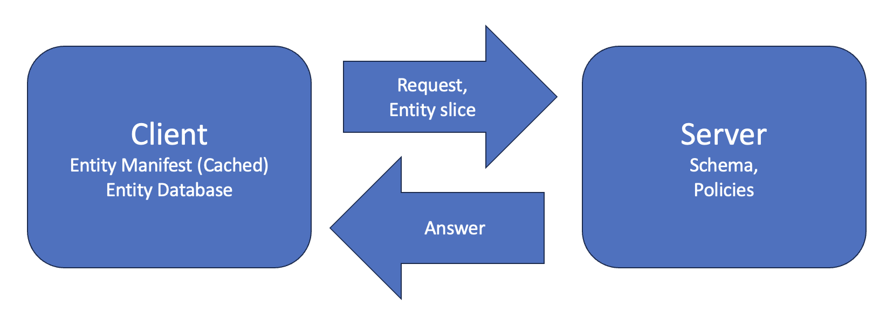

# RFC: Entity Slicing using Data Tries

## Related Issues

- Reference Issues: [#592](https://github.com/cedar-policy/cedar/issues/592)
- Implementation PR(s): [#1102](https://github.com/cedar-policy/cedar/pull/1102)

## Timeline

* Start Date: 2024-06-17
* Date Entered FCP:
* Date Accepted:
* Date Landed:

## Summary

This RFC proposes a new API for describing an **entity slice**: a subset of the entity store needed for a particular request.
This RFC doesn't handle loading the entity slice itself,
instead proposing a data structure called an Entity Manifest.
The Entity manifest describes what entity data is needed 
independent of how it is stored.
Specifically, we propose a new function with signature `(Schema, Policies) -> EntityManifest`. The `Policies` must validate against the `Schema` in strict mode.

The rest of this document follows the following format:

* **Motivation**
* **Example**- example policies show what data paths are needed for what request types.
* **Example Usage**- we’ll show an example use-case for the entity manifest to put the design in context.
* **Data Structure-** we’ll give details of the entity manifest data structure.
* **Computing the Entity Manifest-** we’ll describe the static analysis used to generate the entity manifest.
* **SimplifiedEntityLoader API**- we’ll describe a simple way to use the entity manifest.
* **Drawbacks**- the entity manifest has several limitations to discuss.

## Motivation

Applications using Cedar need to provide entity data along with an authorization request. However, it is cost-prohibitive to provide all of an application’s data on every request, so users will want to provide a minimum amount, a *slice*. This proposal demonstrates a way to provide a **sound** slice: users provide a subset of the data, but get the same answer as if the full dataset had been provided.

The design of entity slicing in this document is meant to achieve several goals:

1. **Easy to use**- Leveraging entity slicing should be easy for Cedar users in a variety of settings
2. **Performant**- Implementing the slice constraints improves performance without introducing too much overhead.
3. **Flexible**- Entity slicing should work on a variety of data storage formats.


## Example

Here is a schema involving users and documents:

```
entity User in [User];

entity Metadata = {
   owner: User,
   time: String,
};

entity Document = {
  metadata: Metadata,
  readers: Set<User>,
};

action Read, Edit appliesTo {
  principal: [User],
  resource: [Document],
};
```


Here are a couple Cedar policies conforming to the schema:

```
// allow documents to be read by anyone in the readers set
permit(
  principal,
  action == Action::"Read",
  resource
)
when
{
  resource.readers.contains(principal)
};

// allow documents to be read and edited by owners
permit(
  principal,
  action in [Action::"Read", Action::"Edit"],
  resource
)
when
{
  resource.metadata.owner == principal
};

// allow read if the user is a global admin
permit(
  principal in User::"GlobalAdmin",
  action in [Action::"Read"],
  resource
);
```

Now, we would like to answer the question: given a request that a **User** would like to **Read** a **Document,** what data is required?

To answer the request correctly, Cedar requires two data paths and one entity’s ancestors in the entity store:

```
Request type: (User, Read, Document)
Data required:
   resource.readers
   resource.metadata.owner
   principal.**ancestors** (where ancestors are the ancestors in the entity hierarchy)
```

On the other hand, if the **User** would like to **Edit** a **Document**, we only need one piece of data:

```
Request type: (User, Edit, Document)
Data required:
  resource.metadata.owner
```


## Example Usage



The image above shows an example usage of the entity manifest. On the left, a client has access to the entity data and a cached entity manifest. On the right, a server stores the schema and policies.

When a client would like to answer a Cedar `Request`, it first consults the cached entity manifest to load the entity slice. Then, it sends the entity slice and the request to the server. The server returns the authorization result.

However, the server or client must take care to ensure that the client’s entity manifest is up-to-date. Since the entity manifest is computed based on the schema and policies, it must be re-computed whenever the schema or policies change. There are multiple ways to ensure that the cache is up to date, one being to tag each entity manifest uniquely and check on each request.

Looking to the future, we hope to provide several options and guidance for how to use the entity manifest:

1. Use the `SimplifiedEntityLoader` api (see later section).
2. Use a specialized entity loader when the format of the database sufficiently matches the schema. For example, Cedar could provide an SQL database data loader.
3. Write custom entity loading that leverages the entity manifest.


## Data structure

This document proposes the **Entity Manifest**, a data structure that specifies the data needed for each type of request. To reduce redundant access paths, the manifest is stored as a Trie.

```
type EntityManifest = HashMap<RequestType, RequestEntityManifest>
```

`RequestType` stores the principal type, resource type, and action UID. This allows entity slicing to be specific to the type of the request, greatly reducing the amount of data required. (The context type can be inferred from the action UID and schema.)

```
pub struct RequestType {
    pub principal: EntityType,
    pub action: EntityUID,
    pub resource: EntityType,
}
```


The `RequestEntityManifest` is a trie storing all the access paths required for the given request type. Access paths all start with Cedar variables and entity literals:

```
/// The root of an entity slice.
#[derive(Debug, Clone, PartialEq, Eq, Serialize, Deserialize, Hash)]
pub enum EntityRoot {
    /// Literal entity ids
    Literal(EntityUID),
    /// A Cedar variable
    Var(Var),
}


/// a [`RequestEntityManifest`] is a trie that specifies what data to load
#[serde_as]
#[derive(Debug, Clone, PartialEq, Eq, Serialize, Deserialize)]
pub struct RequestEntityManifest {
    #[serde_as(as = "Vec<(_, _)>")]
    /// The data that needs to be loaded, organized by root
    pub trie: HashMap<EntityRoot, AccessTrie>,
}
```


Finally, we have the `AccessTrie` data structure, which stores the access paths trie. These paths can also request ancestors in the entity hierarchy. Note: in the implementation, the entity slice also stores optional type annotations.

```
pub struct AccessTrie {
    /// Child data of this entity slice.
    pub children: HashMap<SmolStr, Box<AccessTrie>>,
    /// If the ancestors in the entity hierarchy are required.
    pub ancestors_required: bool
}
```


## Computing the Entity Manifest: High Level

Computing the entity manifest has two parts: **calculating access paths** and **merging** **access paths.**
For calculating access paths, we write a static analysis that finds all the relevant access paths in the policies. Cedar has only four variables (`principal`, `resource`, `action`, and  `context` ), so all data is loaded starting with a variable or entity literal.
For merging access paths, we define a method for merging access paths, sharing common prefixes in a Trie.

The high-level algorithm looks like this:

1. First, perform Cedar type-checking to get type-annotated policies that are specific to the type of the request. 
2. For each type of request
    1. For each policy with that request type
        1. **Compute access paths**
    2. **Merge** all of the access paths into a single entity slice trie


The merge operator for access paths is straightforward. First, convert all access paths directly to a Trie, where the fields in the path are the edges in the Trie. Then, use the standard merge operator on Tries.


## Computing access paths

This section proposes a simple static analysis that soundly computes all of the necessary access paths for a Cedar expression. 
Given a Cedar expression, the analysis produces a pair (`HashMap<EntityRoot, AccessTrie>`, `WrappedAccessPaths`).
The first value is the accumulated trie of data that needs to be loaded.
The second value is the "live" access paths that need to be considered for the particular expression.

`WrappedAccessPaths` represents multiple potential access paths, soundly over-approximating the execution of a cedar expression.
Since Cedar expressions may be record literals, the access paths are wrapped in corresponding record literals in the analysis:

```rust
/// This allows the Entity Manifest to soundly handle
/// data that is wrapped in record or set literals.
#[derive(Debug, Clone, PartialEq, Eq, Default)]
pub(crate) enum WrappedAccessPaths {
    /// No access paths are needed.
    #[default]
    Empty,
    /// A single access path, starting with a cedar variable.
    AccessPath(AccessPath),
    /// The union of two [`WrappedAccessPaths`], denoting that
    /// all access paths from both are required.
    /// This is useful for join points in the analysis (`if`, set literals, ect)
    Union(Box<WrappedAccessPaths>, Box<WrappedAccessPaths>),
    /// A record literal, each field having access paths.
    RecordLiteral(HashMap<SmolStr, Box<WrappedAccessPaths>>),
    /// A set literal containing access paths.
    /// Used to note that this type is wrapped in a literal set.
    SetLiteral(Box<WrappedAccessPaths>),
}
```

The analysis is bottom-up traveral of cedar expressions.
Most operators are strait-forward to analyze, but there are some special cases to get right:

1. For entity or struct dereferences, be sure to add to all `WrappedAccessPaths`.
2. For equality between records (`==` or `.contains`, `.containsAny`, and `.containsAll`), all fields in the type need to be added to the access paths.
3. For if statements, the `Union` variant should be used to ensure both
control-flow cases are covered.
4. Whenever the `WrappedAccessPaths` are dropped, it's important to add them to the accumulated answer.


Now that we have this partition, computing all the access paths is fairly simple:

1. First, find all datapath expressions. These can be translated into access paths directly.
2. Second, handle all instances of equality between records. 
        1. Find all access paths that are children of these operators
            1. Following the schema, fully load all fields for the leaf of the access path
3. Finally, handle instances where the ancestors in the entity hierarchy are required. Annotate the left-hand-side of the `in` operator with the `ancestors_required` flag.


## SimplifiedEntityLoader API

Having the entity manifest enables different data loading strategies that are less precise, but easy to implement.
The easiest is the `SimpleEntityLoader`  api shown here. Users need only write a function for loading entities via their IDs, and Cedar handles determining which entities need to be loaded.


```
/// Implement this trait to load entities based on
/// the entity manifest.
/// This entity loader is called "Simple" for two reasons:
/// 1) First, it may cause database consistency challenges- `load_entities` is called multiple times.
/// 2) Second, it is not precise- the entity manifest only requires some
/// fields to be loaded, but this loader always loads all fields.
pub trait SimpleEntityLoader {
    /// Simple entity loaders must implement `load_entities`,
    /// a function that loads entities based on their `EntityUID`s.
    /// For each element of `entity_ids`, returns the corresponding
    /// [`Entity`] in the output vector.
    fn load_entities(&mut self, entity_ids: impl IntoIterator<Item = &EntityUID>) -> impl Iterator<Item = Entity>;
    
    /// Loads all the entities needed for a request
    /// using the `load_entities` function.
    fn load(
        &mut self,
        schema: &Schema,
        entity_manifest: &EntityManifest,
        request: &Request,
    ) -> Result<Entities, EntityManifestError> {
      ...
    }
}
```


## Drawbacks

### Risk in unverified code

Increasing the complexity of the Cedar API with entity manifests provides new places for users to make mistakes. For example, using an outdated entity manifest can result in unsound entity slices. Another example would be a user writing a buggy implementation of entity loading using the manifest.


### Supporting Partial Loading of Sets

As written, entity manifests in this RFC do not support loading only parts of a Cedar Set, or only some of the ancestors in the entity hierarchy. This is because sets are loaded on the leaves of the access trie, with no way to specify which elements are requested.

To support this feature, we recommend that we take a constraint-based approach. Constraints would be attached to nodes in the access trie, specifying which elements of sets or the parent hierarchy are needed. Constraints form a small query language, so this would increase the complexity of the entity manifest.


# Extended examples

## Paths needed in [document_cloud](https://github.com/cedar-policy/cedar-examples/blob/release/3.2.x/cedar-example-use-cases/document_cloud/policies.cedar) example

```
Action::"CreateDocument"
[
 context.is_authenticated
]

Action::"ViewDocument"
PrincipalType1
ResourceType1
[
  principal.blocked
  resource.owner.blocked
  resource.viewACL
  resource.private
  resource.publicAccess
  resrouce.isPrivate
  context.is_authenticated
]

Action::"ModifyDocument"
[
  principal.blocked
  resource.owner.blocked
  resource.modifyACL
  resource.isPrivate
  context.is_authenticated
]

action::"EditIsPrivate"
[
  principal.blocked
  resource.owner.blocked
  resource.isPrivate
  context.is_authenticated
]

action::"AddToShareACL"
[
  principal.blocked
  resource.owner.blocked
  resource.manageACL
  resource.isPrivate
  context.is_authenticated
]

action::"EditPublicAccess"
[
  principal.blocked
  resource.owner.blocked
  resource.manageACL
  resource.isPrivate
  context.is_authenticated
]

action::"CreateGroup"
[
  resource.isPrivate
  context.is_authenticated
]

action::"ModifyGroup"
[
  resource.owner
  resource.isPrivate
  context.is_authenticated
]

action::"DeleteGroup"
[
  resource.owner
  resource.isPrivate
  context.is_authenticated
]
```


## Paths needed in [tags_n_roles](https://github.com/cedar-policy/cedar-examples/blob/main/cedar-example-use-cases/tags_n_roles/policies.cedar)

```
Action::"Role-A Actions"
principal.allowedTagsForRole
principal.allowedTagsForRole["Role-A"]
principal.allowedTagsForRole["Role-A"]["stage"]
principal.allowedTagsForRole["Role-A"].production_status
principal.allowedTagsForRole["Role-A"]["country"]

resource.tags
resource.tags["production_status"]
resource.tags.country
resource.tags.stage
```


```
Action::"Role-B Actions"
principal.allowedTagsForRole
principal.allowedTagsForRole["Role-B"]
principal.allowedTagsForRole["Role-B"]["stage"]
principal.allowedTagsForRole["Role-B"].production_status
principal.allowedTagsForRole["Role-B"]["country"]

resource.tags
resource.tags["production_status"]
resource.tags.country
resource.tags.stage

```


## Paths needed in [github_example](https://github.com/cedar-policy/cedar-examples/tree/main/cedar-example-use-cases/github_example)

using "ancestors" as Cedar's ancestor relation- requires all ancestors transitively


```
Action::"pull"
resource.readers.ancestors


Action::"fork"
resource.readers.ancestors

Action::"delete_issue"
resource.repo.readers.ancestors
resource.reporter

Action::"assign_issue"
resource.repo.triagers

Action::"push"
resource.writers

Action::"edit_issue"
resource.repo.writers

Action::"delete_issue"
resource.repo.maintainers

Action::"add_reader" ect
resource.admins.ancestors
```


## Paths needed in [tax_preparer](https://github.com/cedar-policy/cedar-examples/tree/main/cedar-example-use-cases/tax_preprarer)

```
Action::"viewDocument"
principal.assigned_orgs ;; could constrain this one to only pull a single element if we run resource first
principal.location
resource.owner.organization
resource.serviceline
resource.location

context.consent.client
context.conset.team_region_list

;; ad-hoc rules luckily don't require more information
```


## Paths needed in [sales_orgs](https://github.com/cedar-policy/cedar-examples/tree/main/cedar-example-use-cases/sales_orgs)

```
Action::"ExternalPrezViewActions"
resource.viewers ;; opportunity to use constraints to pull in only principal in the set

Action::"InternalPrezViewActions"
principal.job
resource.viewers ;; similar constraint opportunity

Action::"PrezEditActions"
resource.owner
resource.editors

Action::"grantViewAccessToPresentation"
context.target.job
context.target.customerId
principal.job
principal.customerId

Action::"grantEditAccessToPresentation"
context.target.job

Action::"MarketTemplateViewActions"
resource.viewerMarkets

Action::"InternalTemplateViewActions"
principal.job
resource.viewers ;; could limit to principal in the set

Action::"TemplateEditActions"
resource.owner
resource.editors
resource.editorMarkets

Action::"grantViewAccessToTemplate"
context.targetUser.job
context.targetUser.customerId 
principal.job 
principal.customerId

Action::"grantEditAccessToTemplate"
context.targetUser.job
```


## Paths needed in [hotel_chains](https://github.com/cedar-policy/cedar-examples/tree/main/cedar-example-use-cases/hotel_chains)

```
Action::"viewReservation" ect
principal.viewPermissions.hotelReservations ;; opportunity for set constraint
principal.viewPermissions.propertyReservations ;;  opportunity for set constraint
principal.hotelAdminPermissions ;;  opportunity for set constraint
principal.propertyAdminPermissions ;;  opportunity for set constraint


Action::"viewProperty" ect
principal.viewPermissions.hotelReservations ;; opportunity for set constraint
principal.viewPermissions.propertyReservations ;;  opportunity for set constraint
principal.hotelAdminPermissions ;;  opportunity for set constraint
principal.propertyAdminPermissions ;;  opportunity for set constraint
```


